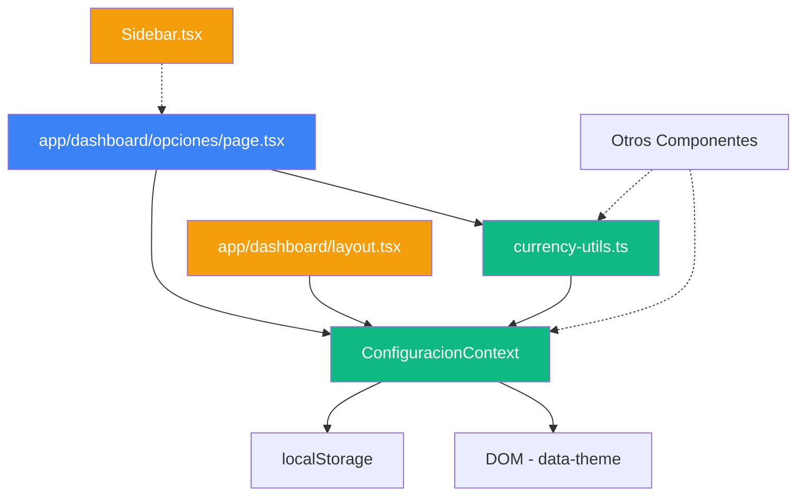

# 📐 Estructura del Proyecto - Página de Opciones

## 🌳 Árbol de Archivos

```
Gestor-Frontend/
│
├── app/
│   ├── dashboard/
│   │   ├── layout.tsx                    [MODIFICADO] ← ConfiguracionProvider
│   │   └── opciones/
│   │       └── page.tsx                  [NUEVO] ← Página principal
│   │
│   └── globals.css                       [MODIFICADO] ← +700 líneas CSS
│
├── components/
│   └── Sidebar.tsx                       [MODIFICADO] ← Enlace a Opciones
│
├── contexts/
│   ├── CarteraContext.tsx                [EXISTENTE]
│   └── ConfiguracionContext.tsx          [NUEVO] ← Estado global
│
├── lib/
│   ├── auth.ts                           [EXISTENTE]
│   ├── gastos.ts                         [EXISTENTE]
│   └── currency-utils.ts                 [NUEVO] ← Utilidades de divisa
│
├── docs/
│   ├── opciones-configuracion.md         [NUEVO] ← Docs técnicas
│   └── QUICK_START_OPCIONES.md          [NUEVO] ← Guía de usuario
│
├── OPCIONES_RESUMEN.md                   [NUEVO] ← Resumen
├── IMPLEMENTACION_COMPLETADA.md          [NUEVO] ← Estado final
└── ESTRUCTURA_OPCIONES.md                [NUEVO] ← Este archivo

```

---

## 📦 Módulos y Dependencias



---

## 🎯 Flujo de Datos

### 1. Carga Inicial

```
Usuario accede → /dashboard/opciones
         ↓
   page.tsx se monta
         ↓
   useConfiguracion() hook
         ↓
ConfiguracionContext lee localStorage
         ↓
   Estado se inicializa
         ↓
     UI se renderiza
```

### 2. Cambio de Configuración

```
Usuario selecciona opción
         ↓
   Función del Context
   (setDivisa, setIdioma, etc.)
         ↓
   Estado se actualiza
         ↓
 localStorage se sincroniza
         ↓
    UI se re-renderiza
         ↓
  Mensaje de éxito
```

### 3. Persistencia

```
      Cambio
         ↓
localStorage.setItem('configuracionUsuario', JSON)
         ↓
   Navegador guarda
         ↓
 Usuario recarga página
         ↓
localStorage.getItem('configuracionUsuario')
         ↓
 Configuración restaurada
```

---

## 🧩 Componentes de la Página

### Estructura JSX

```tsx
<OpcionesPage>
  ├── <Header>
  │   ├── Título
  │   └── Subtítulo
  │
  ├── <Mensajes>
  │   ├── Éxito
  │   └── Error
  │
  └── <ContenedorOpciones>
      │
      ├── <SecciónDivisa>
      │   ├── TarjetaActual
      │   └── GridSelección (12 items)
      │
      ├── <SecciónIdioma>
      │   ├── TarjetaActual
      │   └── ListaOpciones (5 items)
      │
      ├── <SecciónApariencia>
      │   ├── TarjetaActual
      │   └── GridTemas (3 items)
      │
      └── <SecciónSuscripción>
          ├── TarjetaPlanActual
          ├── GridPlanes (3 items)
          └── BotónCancelar
```

---

## 🎨 Clases CSS Principales

### Jerarquía de Estilos

```css
.opciones-container
  └── .opciones-section (x4)
      ├── .opciones-section-header
      │   ├── .opciones-section-title
      │   └── .opciones-section-description
      │
      └── .opciones-section-content
          │
          ├── DIVISA
          │   ├── .divisa-actual-card
          │   │   └── .divisa-info
          │   └── .divisas-grid
          │       └── .divisa-card (x12)
          │           ├── .divisa-card-bandera
          │           ├── .divisa-card-info
          │           └── .divisa-card-check
          │
          ├── IDIOMA
          │   ├── .idioma-actual-card
          │   └── .idiomas-list
          │       └── .idioma-item (x5)
          │
          ├── APARIENCIA
          │   ├── .tema-actual-card
          │   └── .temas-grid
          │       └── .tema-card (x3)
          │
          └── SUSCRIPCIÓN
              ├── .plan-actual-card
              ├── .planes-grid
              │   └── .plan-card (x3)
              │       ├── .plan-destacado-badge
              │       ├── .plan-card-header
              │       ├── .plan-caracteristicas
              │       └── .btn-plan
              └── .cancelar-suscripcion-section
```

---

## 🔄 Context API - Flujo Detallado

### ConfiguracionContext.tsx

```typescript
[Imports]
    ↓
[Tipos y Interfaces]
  - Divisa, Idioma, Tema
  - ConfiguracionUsuario
  - ConfiguracionContextType
    ↓
[Configuración Default]
    ↓
[Símbolos de Divisa]
    ↓
[Context Creation]
    ↓
[ConfiguracionProvider]
  │
  ├── [Estado Local]
  │   ├── config
  │   └── inicializado
  │
  ├── [useEffect: Carga Inicial]
  │   └── cargarConfiguracion()
  │
  ├── [useEffect: Aplicar Tema]
  │   └── aplicarTema()
  │
  ├── [Funciones]
  │   ├── cargarConfiguracion()
  │   ├── guardarConfiguracion()
  │   ├── aplicarTema()
  │   ├── setDivisa()
  │   ├── setIdioma()
  │   ├── setTema()
  │   ├── setSuscripcion()
  │   ├── actualizarConfiguracion()
  │   └── getSimboloDivisa()
  │
  └── [Provider]
      └── value={{ ...funciones }}
          └── {children}
    ↓
[Hook Personalizado]
  useConfiguracion()
```

---

## 🔌 Integración con la Aplicación

### Layout Hierarchy

```
App Root
  └── ProtectedRoute
      └── ConfiguracionProvider  ← [NUEVO]
          └── CarteraProvider
              └── DashboardLayout
                  ├── Sidebar
                  │   └── Link: "/dashboard/opciones"  ← [NUEVO]
                  │
                  └── MainContent
                      └── {children}
                          └── OpcionesPage  ← [NUEVO]
```

### Acceso desde Otros Componentes

```tsx
// Cualquier componente dentro del dashboard

import { useConfiguracion } from '@/contexts/ConfiguracionContext'

function MiComponente() {
  // Acceso directo al estado global
  const { 
    config,           // Estado actual
    setDivisa,        // Cambiar divisa
    setIdioma,        // Cambiar idioma
    setTema,          // Cambiar tema
    setSuscripcion,   // Cambiar suscripción
    getSimboloDivisa  // Obtener símbolo
  } = useConfiguracion()
  
  // Uso
  return (
    <div>
      <p>Divisa: {config.divisa}</p>
      <p>Símbolo: {getSimboloDivisa()}</p>
      <p>Tema: {config.tema}</p>
      <p>Plan: {config.suscripcion.tipo}</p>
    </div>
  )
}
```

---

## 📚 Utilidades (currency-utils.ts)

### Funciones Disponibles

```typescript
// Formateo
formatearMonto(monto, divisa, mostrarSimbolo)
  → "$1,234.56"

formatearMontoCompacto(monto, divisa)
  → "$1.5M"

formatearPorcentaje(porcentaje, decimales)
  → "+25.5%"

// Conversión
convertirDivisa(monto, divisaOrigen, divisaDestino)
  → 92.00

// Obtención
obtenerSimboloDivisa(divisa)
  → "$"

obtenerNombreDivisa(divisa)
  → "Dólar Estadounidense"

// Validación
esDivisaValida(divisa)
  → true/false

// Cálculos
calcularTotal(montos[])
  → suma total

calcularPromedio(montos[])
  → promedio

calcularPorcentajeDiferencia(actual, anterior)
  → % diferencia

// Parsing
parsearMontoInput(valor)
  → número limpio
```

---

## 🎨 Sistema de Temas

### Aplicación del Tema

```
Usuario selecciona tema
         ↓
    setTema(tema)
         ↓
  Context actualiza
         ↓
   useEffect detecta
         ↓
   aplicarTema(tema)
         ↓
  ┌─────┴─────┐
  │           │
Dark/Light   Auto
  │           │
  │      Detectar Sistema
  │           ↓
  │  window.matchMedia()
  │           │
  └───────┬───┘
          ↓
document.documentElement
  .setAttribute('data-theme', valor)
          ↓
    CSS se aplica
```

### CSS con Temas

```css
/* Default (dark) */
body {
  background: #0f172a;
  color: #f8fafc;
}

/* Light theme override */
[data-theme="light"] body {
  background: #f8fafc;
  color: #0f172a;
}

/* Componentes adaptativos */
[data-theme="light"] .card {
  background: white;
  border-color: #e2e8f0;
}
```

---

## 💾 LocalStorage Schema

### Estructura Guardada

```json
{
  "configuracionUsuario": {
    "divisa": "USD",
    "idioma": "es",
    "tema": "dark",
    "suscripcion": {
      "tipo": "premium",
      "fechaInicio": "2024-01-01T00:00:00.000Z",
      "fechaVencimiento": "2024-02-01T00:00:00.000Z",
      "activa": true
    }
  }
}
```

### Operaciones

```javascript
// Guardar
localStorage.setItem(
  'configuracionUsuario',
  JSON.stringify(config)
)

// Leer
const stored = localStorage.getItem('configuracionUsuario')
const config = stored ? JSON.parse(stored) : defaultConfig

// Eliminar
localStorage.removeItem('configuracionUsuario')

// Limpiar todo
localStorage.clear()
```

---

## 🚦 Estados de la UI

### Loading States

```
┌─────────────┐
│   Initial   │
└──────┬──────┘
       │
       ↓
┌─────────────┐
│   Loading   │ ← Spinner visible
└──────┬──────┘
       │
   ┌───┴───┐
   ↓       ↓
┌──────┐ ┌───────┐
│Success│ │ Error │
└───────┘ └───────┘
   │        │
   ↓        ↓
┌─────────────┐
│   Mensaje   │ → Auto-hide (3s)
└─────────────┘
```

### Interactive States

```css
/* Tarjetas de opción */
.divisa-card {
  border: 2px solid rgba(59, 130, 246, 0.2);
}

.divisa-card:hover {
  border-color: rgba(59, 130, 246, 0.5);
  transform: translateY(-2px);
}

.divisa-card.selected {
  border-color: #3b82f6;
  background: rgba(59, 130, 246, 0.15);
}

/* Botones */
.btn-plan:disabled {
  opacity: 0.5;
  cursor: not-allowed;
}

.btn-plan:not(:disabled):hover {
  transform: translateY(-2px);
  box-shadow: 0 4px 12px rgba(0,0,0,0.2);
}
```

---

## 📱 Responsive Breakpoints

### Desktop (> 768px)

```
┌─────────────────────────────┐
│         Sidebar             │ Header
│    (Expandido)              │
├──────────────┬──────────────┤
│              │              │
│    Menú      │   Contenido  │
│              │   Opciones   │
│              │              │
│  - Dashboard │ ┌──────────┐ │
│  - Gastos    │ │ Divisa   │ │
│  - Ingresos  │ │ [Grid 6] │ │
│  - Carteras  │ └──────────┘ │
│  - Opciones✓ │ ┌──────────┐ │
│              │ │ Idioma   │ │
└──────────────┴─│ [Lista]  │─┘
                 └──────────┘
```

### Tablet (768px)

```
┌───────────────────┐
│   Sidebar (Icon)  │ Header
├───┬───────────────┤
│ ☰ │  Contenido    │
│ 🏠 │ ┌───────────┐ │
│ 💰 │ │ Divisa    │ │
│ 📊 │ │ [Grid 4]  │ │
│ 💼 │ └───────────┘ │
│ ⚙️✓│ ┌───────────┐ │
└───┴─│ Idioma    │─┘
      └───────────┘
```

### Mobile (< 768px)

```
┌─────────────┐
│   Burger ☰  │ Header
├─────────────┤
│             │
│ Contenido   │
│             │
│ ┌─────────┐ │
│ │ Divisa  │ │
│ │ [Grid 3]│ │
│ └─────────┘ │
│             │
│ ┌─────────┐ │
│ │ Idioma  │ │
│ │ [Stack] │ │
│ └─────────┘ │
│             │
│ ┌─────────┐ │
│ │ Tema    │ │
│ │ [Stack] │ │
│ └─────────┘ │
└─────────────┘
```

---

## 🔐 Seguridad

### Validaciones Implementadas

```typescript
// Tipos estrictos
type Divisa = 'USD' | 'EUR' | ... // Solo valores válidos

// Validación de entrada
if (esDivisaValida(input)) {
  setDivisa(input as Divisa)
}

// Confirmaciones
const confirmacion = window.confirm('¿Seguro?')
if (!confirmacion) return

// Try-catch en operaciones críticas
try {
  await actualizarSuscripcion()
} catch (err) {
  mostrarError(err.message)
}
```

### Consideraciones de Producción

```typescript
// TODO: Validar en backend
const validarSuscripcion = async () => {
  const response = await fetch('/api/verificar-suscripcion')
  const { valida } = await response.json()
  return valida
}

// TODO: Encriptar datos sensibles
const guardarConfiguracion = (config) => {
  const encrypted = encrypt(JSON.stringify(config))
  localStorage.setItem('config', encrypted)
}

// TODO: Rate limiting
const cambiarSuscripcion = rateLimit(async (plan) => {
  // ... lógica
}, 1000) // Max 1 vez por segundo
```

---

## 📈 Performance

### Optimizaciones Implementadas

1. **Lazy State Updates**
   - Solo re-renderiza cuando cambia el estado relevante
   - useEffect con dependencias específicas

2. **localStorage Async**
   - Guardado no bloquea la UI
   - Try-catch para manejar errores

3. **CSS Transitions**
   - Transiciones con `transform` (GPU-accelerated)
   - Duración óptima (0.3s)

4. **Conditional Rendering**
   - Renderizado condicional de mensajes
   - Componentes solo cuando son necesarios

### Métricas Objetivo

```
First Contentful Paint: < 1.5s
Time to Interactive: < 3.5s
Largest Contentful Paint: < 2.5s
Cumulative Layout Shift: < 0.1
```

---

## 🎓 Patrones de Diseño Utilizados

1. **Context Pattern**
   - Estado global compartido
   - Provider en el root del dashboard

2. **Custom Hook Pattern**
   - `useConfiguracion()` encapsula lógica
   - Interfaz limpia para componentes

3. **Controlled Components**
   - Estado controlado por React
   - Single source of truth

4. **Composition Pattern**
   - Componentes pequeños y reutilizables
   - Composición sobre herencia

5. **Repository Pattern**
   - `currency-utils.ts` como repository
   - Separación de lógica de negocio

---

## ✅ Checklist de Integración

### Para Usar en Nuevos Componentes

- [ ] Importar `useConfiguracion`
- [ ] Destructurar las funciones necesarias
- [ ] Usar `config` para leer estado
- [ ] Usar `setters` para modificar
- [ ] Manejar estados de carga si es async
- [ ] Mostrar mensajes de feedback
- [ ] Testear cambios de configuración

### Ejemplo Completo

```tsx
import { useState } from 'react'
import { useConfiguracion } from '@/contexts/ConfiguracionContext'

function PresupuestoComponent() {
  const { config, getSimboloDivisa } = useConfiguracion()
  const [presupuesto, setPresupuesto] = useState(1000)
  
  return (
    <div>
      <h2>Presupuesto</h2>
      <p>
        Límite: {getSimboloDivisa()}
        {presupuesto.toFixed(2)}
      </p>
      <p>Divisa: {config.divisa}</p>
      <p>Idioma: {config.idioma}</p>
    </div>
  )
}
```

---

**Fin de la Documentación de Estructura** 🎉

